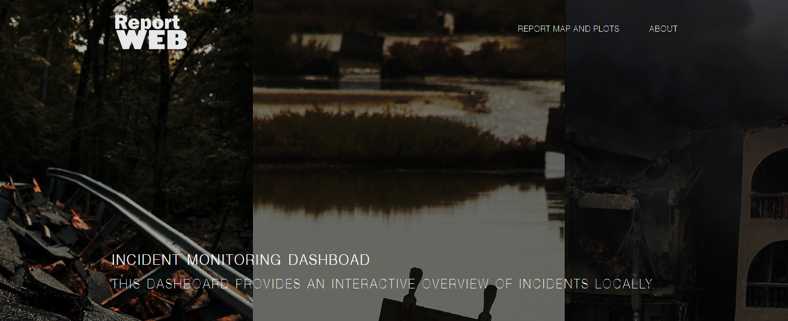

# Report Web - Incident Monitoring Dashboard



**Report Web** is an interactive web-based dashboard that provides an overview of reported incidents in a specific location. This project aims to create an interactive platform for reporting and tracking incidents, helping authorities and organizations respond effectively to various challenges.

## Table of Contents
- [Report Web - Incident Monitoring Dashboard](#report-web---incident-monitoring-dashboard)
  - [Table of Contents](#table-of-contents)
  - [Introduction](#introduction)
  - [Installation](#installation)
  - [**Usage**](#usage)
  - [**Data Sources**](#data-sources)

## Introduction
This dashboard offers an interactive overview of incidents reported in a particular area. Users can explore and filter incidents by category, view detailed information about specific incidents, and interact with an interactive map. It is designed to empower individuals and communities to report issues related to social insecurity, environmental insecurity, and infrastructural problems.

## Installation
To run this application locally, follow these steps:

1. Clone the GitHub repository:


2. Open RStudio or another R environment.

3. Install the required R packages by running the following commands:

```R
install.packages("shiny")
install.packages("shinydashboard")
install.packages("shinyWidgets")
install.packages("shinythemes")
install.packages("plyr")
install.packages("dplyr")
install.packages("sf")
install.packages("tigris")
install.packages("leaflet")
install.packages("htmltools")
install.packages("DT")
install.packages("tidyr")
install.packages("ggplot2")
install.packages("plotly")
install.packages("lubridate")
install.packages("rgdal")
install.packages("sp")
install.packages("maptools")
install.packages("RColorBrewer")
install.packages("rnaturalearth")

1. Set your working directory to the root folder of the project using the **`setwd()`** function.
2. Run the R script (**`app.R`**) to start the Shiny application.

## **Usage**

The dashboard provides several features:

- **Interactive Map**: Explore incidents on an interactive map, filter by category, and view detailed information by clicking on map elements.
- **Incident Statistics**: Get an overview of reported incidents by category, including Insecurity, Floods, Fires, Traffic Accidents, Conflicts, Infrastructure Hazards, and Drought.
- **About Section**: Learn more about the Report Web project, its methodology, and attributions.

## **Data Sources**

The data used in this project does not reflect actual events but serves as a demonstration of the application's capabilities.


